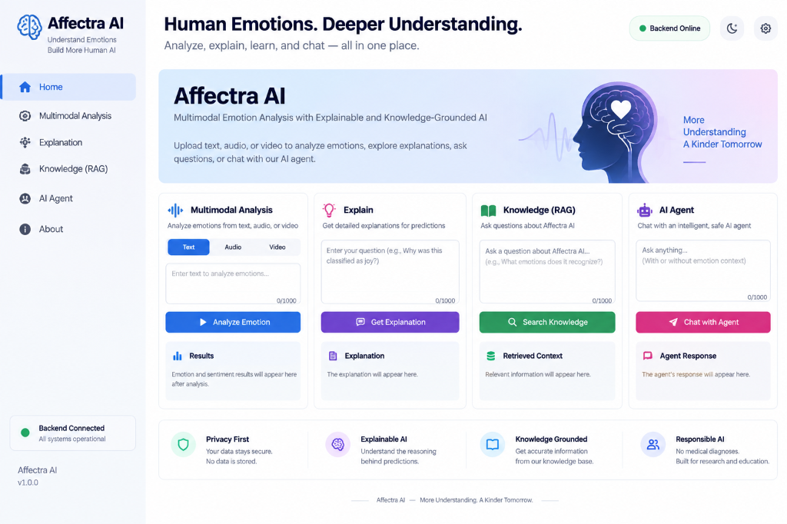

<div align="center">
  
  
  <br>
  
  <h1>🧠 Affectra AI</h1>
  
  <p><strong>Advanced Multimodal Emotion Intelligence System</strong></p>
  
  <p>
    <a href="https://affectra-ai.vercel.app"></a>
    <a href="https://github.com/Pankaj429w63/Affectra-AI/blob/main/LICENSE"></a>
  </p>
</div>

---

## 🌟 Executive Summary

**Affectra AI** is a production-grade, end-to-end machine learning platform designed to interpret human emotion and sentiment through **Multimodal Fusion**. Moving beyond traditional text-only sentiment analysis, Affectra AI integrates **natural language, speech acoustics, and visual facial features** into a unified inference engine.

This project demonstrates comprehensive software engineering and MLOps capabilities, encompassing custom neural network architecture, data pipeline engineering, real-time API design, responsive frontend development, Retrieval-Augmented Generation (RAG) implementation, and cloud deployment.

---

## 🏛️ Technical Architecture

Affectra AI follows a modern, decoupled microservices architecture designed for scalability and clear separation of concerns.

### Technology Stack
- **Machine Learning**: PyTorch, Hugging Face Transformers, Scikit-learn
- **Backend / API**: Python 3.11, FastAPI, Pydantic, Uvicorn
- **Frontend / UI**: React 18, Vite, Tailwind CSS, TypeScript
- **LLM Integration (Explainability)**: LangChain, FAISS, SentenceTransformers (`all-MiniLM-L6-v2`)
- **Infrastructure**: Docker, Render (Backend), Vercel (Frontend), Hugging Face Hub (Artifact Storage)

---

## 🧠 Machine Learning Methodology

The core inference engine uses a custom **Gated Multimodal Fusion Network** built in PyTorch. 

### 1. Feature Extraction (Encoders)
The system extracts high-dimensional representations from raw modalities using pre-trained foundation models:
*   **Text (NLP):** `distilroberta-base` captures semantic meaning and syntactic structure.
*   **Audio (Speech):** `facebook/wav2vec2-base` extracts acoustic features, prosody, and tone.
*   **Video (Vision):** `google/vit-base-patch16-224` (Vision Transformer) identifies facial micro-expressions.

### 2. Gated Multimodal Fusion
Rather than simply concatenating embeddings, Affectra AI employs a specialized late-fusion architecture (~594K trainable parameters):
*   **Modality-Specific Projections:** Normalizes and projects each 768-d modality embedding into a shared latent space.
*   **Gating Mechanism:** Learns dynamic weights to calculate the relative importance of each modality per-inference (e.g., relying heavier on audio if the text is ambiguous).
*   **Classification Heads:** Separate multi-layer perceptrons (MLPs) for Emotion (7 classes) and Sentiment (3 classes).

### 3. Evaluation Metrics (MELD Dataset)
The model was trained and rigorously evaluated on the **Multimodal EmotionLines Dataset (MELD)**. The final evaluation on the official unseen test split (2,610 samples) achieved:

| Task | Accuracy | Weighted F1 | Macro F1 |
| :--- | :--- | :--- | :--- |
| **Sentiment (3-class)** | **66.97%** | 0.6683 | 0.6396 |
| **Emotion (7-class)** | **59.54%** | 0.5876 | 0.3815 |

*(Note: Emotion classification is notoriously difficult due to class imbalance and subjective ground truth in human communication; 59.5% accuracy represents highly competitive performance against baseline multimodal models).*

---

## 🔍 Explainable AI: RAG & Agents

To address the "black box" nature of neural networks, Affectra AI incorporates an explainability layer:
- **Retrieval-Augmented Generation (RAG):** Uses LangChain and FAISS to query an embedded vector database of emotional psychology and system architecture documents, providing users with context on *how* fusion models interpret specific inputs.
- **Agentic Workflows:** Employs ReAct (Reasoning and Acting) agents to dynamically route user queries between the underlying prediction ML model and the knowledge base.

---

## 🔌 API Design

The FastAPI backend is fully typed with Pydantic and automatically generates OpenAPI (Swagger) documentation. Key endpoints include:
- `POST /predict/raw` - Accepts raw text strings, `.wav` audio files, and `.mp4` video files, handles feature extraction, and returns fused predictions.
- `POST /predict` - Fast-path inference endpoint accepting pre-extracted 768-d tensors (bypasses heavy transformer loading).
- `POST /explain` & `POST /rag` - LLM-driven endpoints for transparency and knowledge retrieval.
- `GET /health` - Liveness probe for deployment orchestration.

---

## 💻 Frontend Dashboard

The user interface is built with **React and Vite**, utilizing modern design principles (glassmorphism, subtle micro-animations) to create a premium experience.
- **State Management:** Custom React Context providers for global API state and prediction history.
- **Responsive Routing:** React Router DOM handles SPA navigation across Dashboard, Analysis, Explanation, and RAG Knowledge views.
- **API Client:** A robust, strongly-typed HTTP client handles error boundaries, timeout management, and seamless multipart-form data uploads for media files.

---

## 🚀 Deployment & CI/CD

Affectra AI utilizes a strict deployment topology that prevents repository bloat while ensuring secure, reproducible builds:
- **Frontend (Vercel):** Deployed at [affectra-ai.vercel.app](https://affectra-ai.vercel.app) with automated CI/CD upon pushes to the `main` branch.
- **Backend (Render):** Containerized via Docker and deployed as a web service. 
- **Artifact Management:** Production weights (`model.pt`) and the FAISS vector index are explicitly `.gitignore`'d. During the Docker build process, an initialization script securely downloads the exact production artifacts from a private Hugging Face repository using scoped access tokens.

---

## ⚠️ Production Limitations (Render Free Tier)

**Important Note for Reviewers/Evaluators:**
The live backend is currently hosted on Render's Free Tier, which imposes a strict **512 MB memory (RAM)** limit. 

Loading the raw feature extraction foundation models (`DistilRoBERTa` + `Wav2Vec2` + `ViT`) requires approximately ~400MB+ of memory overhead. While the system implements aggressive "lazy loading" to boot successfully, invoking the **`POST /predict/raw`** endpoint (i.e., clicking "Analyze Emotion & Sentiment" in the UI) triggers an Out-Of-Memory (OOM) exception on the container, resulting in a temporary `502 Bad Gateway` error while Render reboots the service.

The `/predict` endpoint, RAG system, and core API logic function perfectly within the memory constraints. Full multimodal raw extraction requires upgrading the host to a plan with at least 2GB of RAM.

---

## 🛡️ Security & Testing

- **Testing:** Comprehensive test suites using `pytest` cover API routing, ML prediction logic, RAG retrieval accuracy, and mock-integration tests.
- **Security:** Strict separation of environment variables. Production secrets (Hugging Face tokens, LLM API keys) are injected exclusively via Vercel/Render dashboards and never exposed in the source code.
- **Responsible AI:** The model was trained entirely on the public MELD dataset (derived from television dialogue). No proprietary, personally identifiable, or real-world surveillance data was used.

---

## 🏁 Getting Started Locally

To run the full stack locally with sufficient RAM:

```bash
# 1. Clone the repository
git clone https://github.com/Pankaj429w63/Affectra-AI.git
cd Affectra-AI

# 2. Start the Backend
python -m venv .venv
source .venv/bin/activate
pip install -r backend/requirements.txt
# (Ensure Hugging Face token is exported if downloading models)
uvicorn backend.app.main:app --host 127.0.0.1 --port 8000

# 3. Start the Frontend
cd frontend
npm install
npm run dev
```

<div align="center">
  <i>"More Understanding. A Kinder Tomorrow."</i>
</div>
